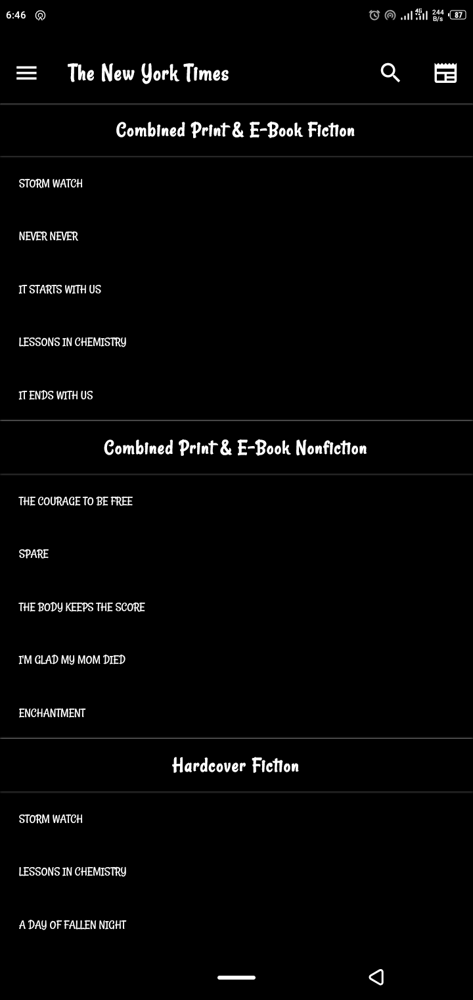
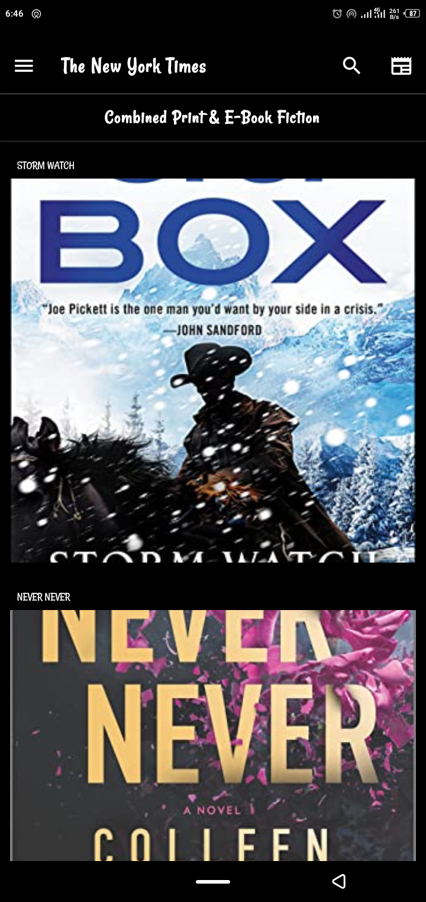

# nyt

A new Flutter project.

## Getting Started

#Intro

**This is a Flutter made application, cross-platform i.e, > IOS and Android and can also run in the Web**

It is implemented to fetch from the New York Times Best-seller books of all times.

Well laid UI / UX for starter projects.

Check it out!

```
import 'package:http/http.dart';
import 'dart:convert';
//oop class entity 
class News{
  String? source;
  String? title;
  String? url;
  String? image_url;
  String? description;
  String? published;
  String? content;

  News({this.source,this.title,this.url,this.image_url,this.description,this.published,this.content});

  News.fromJson(Map json):
    source=json['source']['name'],
    title=json['title'],
    url=json['url'],
    image_url = json['urlToImage'],
    description = json['description'],
    published = json['publishedAt'],
    content = json['content'];
}

fetchNewsFunc() async {
  try{
  Response response = await get(Uri.parse('https://newsapi.org/v2/everything?q=bitcoin&apiKey=2b3c34d8bafc4b21a0fa19e67ae7244b'));
  Map data = jsonDecode(response.body);

  var dataFromApi=data['articles'].map((article)=>News.fromJson(article)).toList();
  
  print("loading");
  print(data['totalResults']);
  int count = data['totalResults'];

  return dataFromApi;

  }catch(e) {
    print(e);
    return [];
  }
}

```


<br>

<br>

<br>

